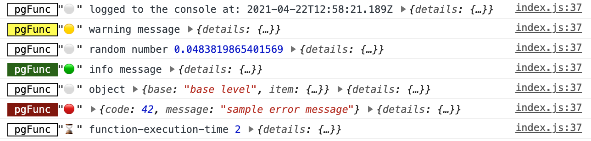

# SupaScriptConsole
Javascript library for local console logging of Supabase rpc calls (PostgreSQL functions)

## Purpose
This library allows you see the console log output from your Supabase / PostgreSQL server functions written in [SupaScript](https://github.com/burggraf/SupaScript).  (SupaScript is a JavaScript-based, NodeJS-like, Deno-inspired set of extensions for Supabase & PostgreSQL server functions.)

## Example
Here's a screen shot of the Google Chrome Console showing console logging for a function running in a Supabase PostgreSQL instance:



And you can drill down on the "details" object to get complete details on the log item:


## Install
```
npm install https://github.com/burggraf/SupaScriptConsole.git --save
```

## Usage
Import the library at the top of your module:
```js
import { startLogging } from 'supascriptconsole';
```
Now just call it in your code (usually in a constructor or other startup code):
```js
startLogging({supabase: this.supabase});
```
To stop logging, just assign the output to a variable then call `unsubscribe()` on that variable later.
```js
this.subscription = startLogging({supabase: this.supabase});
// later
this.subscription.unsubscribe();
```
